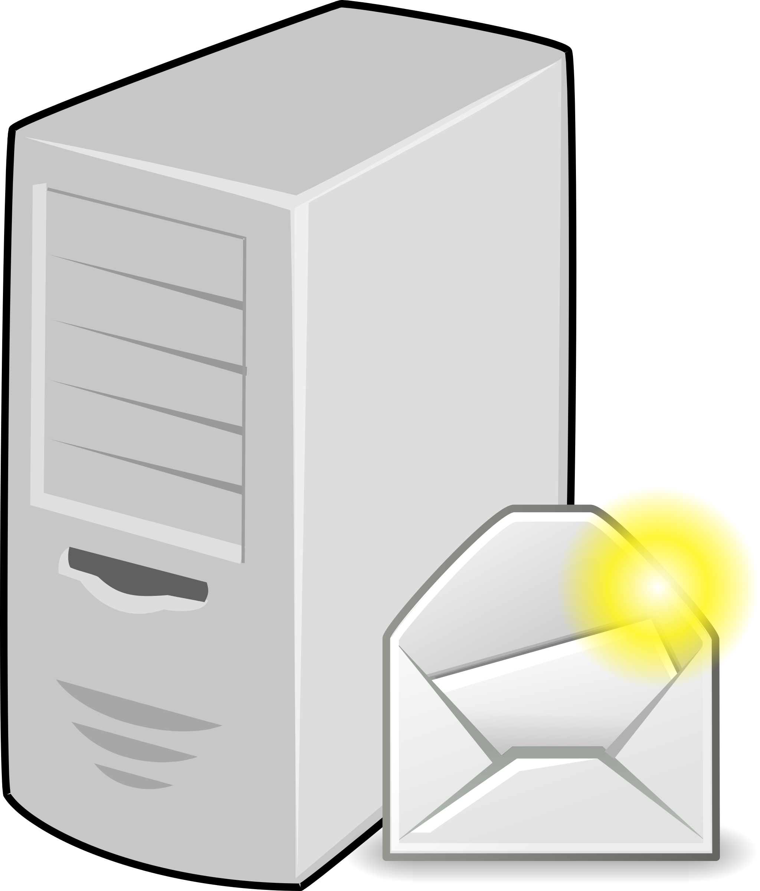

# Servidor de Correo con Postfix y Dovecot – Mail y Listas de Distribución

## Descripción del Proyecto
Proyecto personal de **Administración de Sistemas** enfocado en la configuración de un servidor de correo completo con **Postfix** (SMTP) y **Dovecot** (IMAP/POP3), dominios virtuales, usuarios virtuales, listas de distribución, aliases y pruebas de envío/recepción interna y externa.

Características principales:
- Instalación y configuración de Postfix y Dovecot.
- Configuración de dominios virtuales y aliases para usuarios y listas.
- Listas de distribución para envíos grupales.
- Usuarios virtuales con directorios Maildir.
- Pruebas con Thunderbird para envío/recepción interna y externa.
- Verificación de conexiones con telnet a puertos SMTP/IMAP/POP3.
- Configuración de NAT y rutas para acceso externo.

Entorno reproducible en Linux con pruebas de funcionalidad completa.

## Tecnologías y Herramientas Utilizadas
- **Postfix** para SMTP, aliases y listas de distribución
- **Dovecot** para IMAP/POP3 y recepción segura
- Archivos: /etc/postfix/main.cf, virtual, aliases; /etc/dovecot/dovecot.conf, 10-mail.conf, 10-auth.conf
- **Thunderbird** como cliente para pruebas reales
- Comandos: telnet, systemctl status, postmap, adduser, mkdir Maildir
- NAT y rutas para simular entorno externo

## Objetivos Alcanzados
- Servidor de correo funcional con envío y recepción segura.
- Implementación de listas de distribución y aliases virtuales.
- Autenticación y directorios Maildir para usuarios virtuales.
- Pruebas internas y externas con clientes reales.
- Verificación de puertos y conexiones con telnet.

## Proceso Completo – Explicación Detallada

El proceso inicia con la creación de las máquinas virtuales y la asignación de adaptadores de red para cada una, asegurando la conectividad adecuada. A continuación, se asignan direcciones IP estáticas en ambas máquinas: la Máquina 1 actúa como servidor de correo principal, y la Máquina 2 como cliente o relay para pruebas.

Se crean usuarios locales en las dos máquinas utilizando adduser y estableciendo contraseñas, lo que permite probar autenticación y envíos. Luego, se edita el archivo /etc/hosts en ambas máquinas para resolver nombres de dominio localmente, facilitando la resolución de hosts sin DNS externo.

Se instala Postfix en cada máquina, seleccionando el tipo "Internet Site" y configurando el nombre del sistema durante la instalación. Se revisa y edita el archivo /etc/postfix/main.cf para definir el hostname, domain, virtual alias domains y relayhost si es necesario.

Se crea el archivo /etc/postfix/virtual para definir dominios virtuales y usuarios virtuales, y se añaden aliases para listas de distribución, permitiendo que un correo enviado a una dirección de lista se distribuya a múltiples usuarios. Se ejecuta postmap /etc/postfix/virtual para actualizar la base de datos de aliases y virtuales.

Se reinicia el servicio Postfix y se verifica su estado con systemctl status para asegurar que está activo sin errores. Se instala mailutils para permitir pruebas de envío desde la consola.

Para Dovecot, se edita /etc/dovecot/dovecot.conf para habilitar los protocolos IMAP y POP3. Se modifica /etc/dovecot/conf.d/10-mail.conf para definir el mail_location como maildir:~/Maildir, y /etc/dovecot/conf.d/10-auth.conf para permitir autenticación plaintext durante las pruebas (disable_plaintext_auth = no).

Se reinicia Dovecot y se verifica su estado con systemctl status. Se crean directorios Maildir para los usuarios virtuales utilizando mkdir -p para almacenar los correos.

Se verifican las conexiones con telnet a los puertos SMTP (25), IMAP (143) y POP3 (110) para confirmar que los servicios están escuchando y respondiendo correctamente.

Se configuran cuentas en Thunderbird para los usuarios, probando envío y recepción. Se realizan pruebas de envío de correo interno entre usuarios locales, y externo (por ejemplo, a Gmail), verificando recepción en ambos casos. Se prueban las listas de distribución enviando a la dirección de lista y confirmando que llega a todos los miembros.

Finalmente, se configura NAT y rutas para simular acceso externo, y se verifica el flujo completo con pruebas adicionales de envío/recepción bajo NAT.

## Capturas del Proceso Completo

  
  
  
  
  
  
  
  
  
  
  
  
  
  
  
  
  
  
  
  
  
  
  
  
  

## Aprendizajes Clave
- Configuración de Postfix para dominios virtuales y listas de distribución.
- Dovecot para recepción segura con IMAP/POP3.
- Pruebas con Thunderbird y telnet para verificación.
- Gestión de NAT y rutas para acceso externo.

## Relevancia Profesional
Habilidades para:
- Administración de servidores de correo (internos/externos).
- DevOps/Cloud (base para servicios como AWS SES o Google Workspace).
- Ciberseguridad (autenticación y conexiones seguras).

## Conclusión
Proyecto funcional con servidor de correo, listas de distribución y pruebas completas.

¡Gracias por visitar! Dale ⭐ si te gusta.

---
**Autor**: Pau Olivé Moreno  
**Fecha**: Principios de 2025